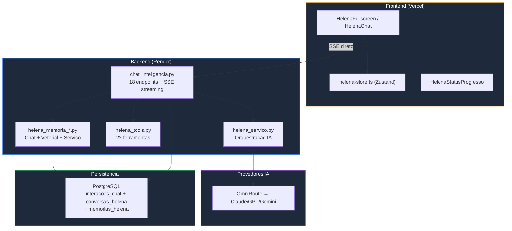

# SKILL: Helena — Chat, Memórias e Inteligência

> **Propósito**: Documentação completa do sistema de chat Helena (Dra. Helena Strategos), incluindo memórias persistentes, deep research, auditoria, text-to-speech e integração com o frontend.

---

## QUANDO USAR ESTA SKILL

- Trabalhar com chat da Helena no frontend ou backend
- Debugar sistema de memórias
- Implementar novos modos de chat (sonho, deep research)
- Integrar TTS (text-to-speech)
- Entender o fluxo completo de conversação com IA

---

## VISÃO GERAL DO SISTEMA

> **Diagramas completos**: Ver [HELENA_MAPA.md](../helena-master/HELENA_MAPA.md) — 12 diagramas Mermaid detalhados.



---

## BACKEND — SERVIÇOS HELENA (7 arquivos)

### Serviços

| Arquivo | Função | Modelo IA |
|---------|--------|-----------|
| `helena_servico.py` | Orquestração principal | Opus |
| `helena_memoria_chat.py` | Memória de conversa (contexto) | — |
| `helena_memoria_servico.py` | CRUD memórias persistentes | — |
| `helena_documentos.py` | Geração Word/PDF/Excel | Sonnet |
| `helena_email.py` | Envio de emails | — |
| `helena_planilhas.py` | Geração de planilhas Excel | — |
| `helena_navegacao.py` | Automação de navegação web | — |

### Rotas (3 arquivos, 19 endpoints)

**chat_inteligencia.py** → `/api/v1/chat-inteligencia/` (9 endpoints)
| Método | Rota | Função |
|--------|------|--------|
| POST | `/chat-inteligencia/` | Chat principal com Helena |
| POST | `/chat-inteligencia/auditoria` | Auditoria de resposta |
| GET | `/chat-inteligencia/historico/{sessao_id}` | Histórico de sessão |
| GET | `/chat-inteligencia/todas` | Todas as conversas |
| GET | `/chat-inteligencia/analytics` | Analytics de uso |
| GET | `/chat-inteligencia/memoria/indice` | Índice de memórias |
| GET | `/chat-inteligencia/memoria/busca` | Busca em memórias |
| GET | `/chat-inteligencia/memoria/sessao/{id}` | Memórias por sessão |
| POST | `/chat-inteligencia/memoria/compactar/{id}` | Compactar memórias |
| POST | `/chat-inteligencia/stream` | Streaming SSE com status progressivos |
| POST | `/migrate/compactacao` | Migração DB para campos de compactação |

**helena_conversas.py** → `/api/v1/helena/` (3 endpoints)
| Método | Rota | Função |
|--------|------|--------|
| GET | `/helena/conversas` | Listar conversas |
| GET | `/helena/conversas/{sessao_id}` | Obter conversa |
| PATCH | `/helena/conversas/{sessao_id}` | Atualizar conversa |

**helena_memorias.py** → `/api/v1/helena/` (7 endpoints)
| Método | Rota | Função |
|--------|------|--------|
| GET | `/helena/memorias` | Listar memórias |
| POST | `/helena/memorias` | Criar memória |
| GET | `/helena/memorias/contexto` | Contexto ativo |
| POST | `/helena/memorias/compactar/{sessao_id}` | Compactar sessão |
| GET | `/helena/memorias/export/md` | Exportar Markdown |
| DELETE | `/helena/memorias/{id}` | Deletar memória |
| POST | `/helena/memorias/decair` | Decay de relevância |

---

## FRONTEND — COMPONENTES HELENA (5)

### Componentes em `components/helena/`

| Componente | Função | Props |
|-----------|--------|-------|
| `HelenaChat.tsx` | Widget de chat principal | sessaoId, onMessage |
| `HelenaFullscreen.tsx` | Chat em tela cheia | sessaoId |
| `HelenaQuickTake.tsx` | Resposta rápida inline | query, context |
| `HelenaConversasList.tsx` | Lista de conversas anteriores | onSelect |
| `HelenaMemoriasPanel.tsx` | Painel de memórias | sessaoId |
| `HelenaStatusProgresso.tsx` | Status progressivo com barra | status, etapa, totalEtapas, icone |

### API Routes do Frontend

| Rota | Função | Modo |
|------|--------|------|
| `/api/chat-inteligencia` | Chat streaming | POST streaming |
| `/api/chat-inteligencia/deep-research` | Pesquisa profunda | POST |
| `/api/chat-inteligencia/pesquisas` | Análise de pesquisas | POST |
| `/api/chat-inteligencia/sonho` | Modo onírico | POST |
| `/api/chat-inteligencia/tts` | Text-to-Speech | POST |
| `/api/helena` | Helena geral | POST |
| `/api/helena-conversas` | Conversas | POST |
| `/api/helena-deep-research` | Deep research | POST |
| `/api/helena-memorias` | Memórias | POST |
| `/api/helena-pesquisas` | Pesquisas | POST |
| `/api/helena-tts` | TTS | POST |
| `/api/warroom-helena` | War Room | POST |

---

## MODOS DE OPERAÇÃO DA HELENA

### 1. Chat Normal
Conversa padrão com contexto de memória.
- **Modelo**: Opus (via OmniRoute)
- **Contexto**: Últimas 10 mensagens + memórias relevantes
- **Streaming**: Sim (SSE)

### 2. Deep Research
Pesquisa profunda com 5 camadas de busca.
- **Modelo**: Opus
- **Camadas**: Web → Docs → Base dados → Agentes → Síntese
- **Tempo**: 30-120s

### 3. Análise de Pesquisas
Análise de resultados de pesquisas eleitorais.
- **Input**: Dados de pesquisa + filtros
- **Output**: Insights, tendências, recomendações

### 4. Modo Onírico (Sonho)
Modo criativo sem restrições analíticas.
- **Modelo**: Opus
- **Comportamento**: Livre associação, cenários inusitados
- **Uso**: Brainstorming estratégico

### 5. Auditoria
Audita respostas anteriores para consistência.
- **Input**: Resposta + contexto original
- **Output**: Score de qualidade + correções

### 6. War Room
Análise estratégica com visão de "sala de guerra".
- **Modelo**: Opus
- **Input**: Cenário eleitoral + dados de pesquisa
- **Output**: Análise SWOT, recomendações urgentes

### 7. Text-to-Speech
Converte respostas em áudio.
- **Provider**: ElevenLabs
- **Voz**: Configurável
- **Output**: MP3 stream

### 8. Streaming com Status Progressivos
Feedback em tempo real do que Helena está fazendo.
- **Protocolo**: Server-Sent Events (SSE)
- **7 etapas**: Base de conhecimento → Memória semântica → Intel eleitoral → Ferramentas → Contexto → Análise IA → Resposta
- **Ícones**: brain, database, tools, shield, ai (mapeados para Lucide icons no frontend)
- **Componente**: `HelenaStatusProgresso.tsx` (barra de progresso + ícone pulsante)
- **Thinking mode**: Se modelo demora >20s, mostra "Raciocínio profundo em andamento..."

---

## SISTEMA DE MEMÓRIAS

### Tipos de Memória

| Tipo | Tabela | Persistência | Uso |
|------|--------|-------------|-----|
| **Chat** | `interacoes_chat` | Por sessão | Contexto imediato |
| **Helena** | `memorias_helena` | Persistente | Aprendizado de longo prazo |
| **Conversa** | `conversas_helena` | Persistente | Histórico completo |

### Modelo de Memória Helena

```python
class MemoriaHelena(Base):
    __tablename__ = "memorias_helena"

    id: int
    sessao_id: str              # Identificador da sessão
    tipo: str                   # "insight", "decisao", "fato", "preferencia"
    conteudo: str               # Texto da memória
    relevancia: float           # 0.0 a 1.0 (decay temporal)
    tags: list[str]             # Tags para busca
    contexto: dict              # Contexto original
    created_at: datetime
    updated_at: datetime
```

### Ciclo de Vida da Memória

```
1. CRIAÇÃO
   → Após cada interação significativa
   → Helena decide o que memorizar
   → Relevância inicial: 1.0

2. DECAY (Decaimento)
   → POST /helena/memorias/decair
   → Reduz relevância com o tempo
   → Fórmula: relevancia *= 0.95 (por dia)

3. COMPACTAÇÃO
   → POST /helena/memorias/compactar/{sessao_id}
   → Consolida memórias similares
   → Remove redundâncias

4. RECUPERAÇÃO
   → GET /helena/memorias/contexto
   → Busca memórias relevantes ao tópico atual
   → Ordena por relevância × recência

5. EXPORT
   → GET /helena/memorias/export/md
   → Exporta todas memórias em Markdown
```

### Principios de Gestao de Contexto (aplicar em toda compactação)

O contexto de Helena e como memoria RAM de um computador — limitado e precioso. Tres regras para nao desperdicar:

**1. Comprimir, NUNCA descartar** — Quando o contexto enche, a reacao natural e cortar as mensagens mais antigas. ERRADO. Mensagens antigas podem conter decisoes criticas, compromissos ou dados-chave. Em vez de cortar, COMPRIMA: gere um resumo que preserve as informacoes essenciais e descarte so o texto verboso. Isso garante ~100% de retencao de informacao critica vs ~65% quando voce simplesmente trunca.

**2. Valor da mensagem = recencia + importancia + bonus de info-chave** — Nem toda mensagem vale igual. Ao decidir o que comprimir primeiro, pontuar cada mensagem:
- Recencia: mensagens recentes valem mais (decay temporal)
- Importancia: mensagens com decisoes, numeros, compromissos ou instrucoes valem mais
- Bonus: mensagens com dados estruturados (JSON, tabelas, configs) NUNCA devem ser descartadas — comprimir com cuidado extremo

**3. Tres camadas de armazenamento** — Tratar o contexto como hierarquia:
- **Tier 0 (Ativo)**: Contexto carregado na janela atual. Acesso instantaneo. So o essencial.
- **Tier 1 (Quente)**: Resumos compactados de sessoes recentes. Recuperavel em ~1s. Guardar em DB.
- **Tier 2 (Frio)**: Transcricoes completas. Recuperavel em ~3s. Guardar em arquivo.

Quando Helena precisa de algo que esta no Tier 1 ou 2, promover para o Tier 0 (como "page fault" em SO). Isso evita o problema de "amnesia" — a informacao existe, so nao esta carregada.

**4. Self-monitoring: Helena deve saber quanto contexto resta** — Injetar no system prompt de Helena uma linha com o uso atual de contexto. Com essa informação, Helena se auto-regula: fica mais concisa quando esta perto do limite, e sabe pedir compactação antes de estourar. Sem esse sinal, ela opera às cegas e estoura sem aviso.

**Template copiável para system prompt**:
```
[CTX: {uso_percent}% | {tokens_usados}k/{tokens_max}k | compactação em ~{tokens_restantes}k]
[MODO: {modo_atual} | TURNO: {num_turno} | MEMÓRIAS: {num_memorias_carregadas}]
```

**Regras de auto-regulação por faixa**:
- `CTX < 40%`: Operar normalmente, respostas completas
- `CTX 40-60%`: Respostas mais concisas, priorizar dados sobre narrativa
- `CTX 60-80%`: Modo telegráfico, comprimir histórico, sugerir compactação
- `CTX > 80%`: FORÇAR compactação antes de responder, máximo 3 frases por resposta

**Implementação** (`helena_servico.py`): Calcular `uso_percent = len(mensagens_serializadas) / TOKEN_MAX * 100` e injetar a linha no system prompt antes de cada chamada.

**4b. Resposta longa = sinal de incerteza** — Quando Helena (ou qualquer modelo via OmniRoute) gera uma resposta significativamente mais longa que a média para aquele tipo de tarefa, isso NÃO significa que ela está sendo mais profunda. Significa que está LUTANDO com um caso difícil. Usar isso como detector de ambiguidade:
- Se a resposta tem >2x o comprimento médio para aquele tipo de pergunta → marcar como "confiança baixa"
- Se dois modelos diferentes (ex: Helena via Opus + Helena via Sonnet) geram respostas de comprimentos muito distintos para o MESMO input → sinal de caso ambíguo
- Respostas curtas e diretas tendem a ser mais precisas que respostas longas e elaboradas. Não confundir verbosidade com qualidade.

**5. Ao comprimir, preservar o "sabor narrativo"** — Mensagens que contem elementos narrativos (uma historia pessoal do usuario, um exemplo concreto com personagem, uma sequencia de eventos) devem receber BONUS no scoring de valor. Porque? Essas mensagens sao as que tornam as respostas de Helena envolventes. Se voce comprime TUDO para bullet points secos, Helena perde a capacidade de responder com engajamento. Comprimir o verboso, preservar o narrativo.

**6. Existe um núcleo estável que SEMPRE importa** — Em qualquer sessão longa, ~60% das mensagens são relevantes para QUALQUER tarefa futura (decisões, compromissos, dados-chave, preferências do usuário). Os outros ~40% são específicos de uma tarefa pontual. Na compactação, NUNCA comprimir o núcleo estável. Comprimir primeiro os 40% pontuais. Como identificar o núcleo: mensagens que contêm decisões, dados estruturados, preferências declaradas, compromissos ou instruções recorrentes. Se a mensagem seria útil em QUALQUER conversa futura (não só nesta), ela é núcleo.

**7. Dados ruins são ATIVAMENTE prejudiciais — remover, não ignorar** — Mensagens irrelevantes ou ruidosas no contexto não são neutras — elas PIORAM a qualidade das respostas. Injetar histórico irrelevante (ex: conversa sobre tema A quando o assunto agora é B) é pior do que não ter histórico nenhum. Na compactação, priorizar REMOÇÃO de lixo antes de compressão de conteúdo útil. Limpar > comprimir.

**8. Hibernação completa para sessões longas** — Compactação gera resumo (Tier 1). Mas para sessões que vão ser retomadas dias depois, fazer HIBERNAÇÃO: serializar estado completo (contexto + variáveis locais + decisões + próximos passos) num checkpoint. Quando o usuário voltar, restaurar o checkpoint inteiro em vez de tentar reconstruir do resumo. Resumo perde nuance. Checkpoint preserva tudo.

### Compactação Real de Sessão (400k tokens)

```
1. DETECÇÃO
   → Após cada mensagem, backend soma tokens da sessão
   → Se >= 400.000 tokens, dispara compactação

2. GERAÇÃO DE RESUMO
   → LLM leve (combo haiku-tasks) gera JSON estruturado:
     - resumo_executivo
     - decisoes_tomadas
     - tarefas_pendentes
     - contexto_ativo
     - licoes_aprendidas
   → Timeout: 15s, fallback por regex se LLM falhar

3. CRIAÇÃO DE NOVA SESSÃO
   → Nova ConversaHelena com:
     - sessao_anterior_id = sessão antiga
     - resumo_compactacao = JSON do resumo
   → Sessão antiga marcada como compactada=True

4. INJEÇÃO NO CONTEXTO
   → Próxima mensagem na nova sessão:
     → _obter_resumo_sessao_anterior() busca resumo
     → Injetado no system prompt como [CONTEXTO SESSAO ANTERIOR]
   → Helena sabe tudo que foi discutido antes

5. FRONTEND
   → Evento done inclui compactacao_necessaria + nova_sessao_id
   → Mensagem system "Sessão compactada" aparece
   → Após 1.5s, store troca para nova sessão (tela limpa)
```

### Busca de Memórias

```python
# Busca por texto
GET /helena/memorias?busca=celina+campanha

# Busca por tags
GET /helena/memorias?tags=eleicao,estrategia

# Busca por sessão
GET /helena/memorias?sessao_id=abc-123

# Contexto ativo (memórias mais relevantes)
GET /helena/memorias/contexto?topico=cenario+eleitoral&limit=10
```

---

## FLUXO DE CHAT COMPLETO (Streaming SSE)

```
1. Usuário digita mensagem
   ↓
2. HelenaFullscreen.tsx
   → enviarComStream() via POST /api/v1/chat-inteligencia/stream
   → AbortController para cancelamento
   ↓
3. chat_inteligencia.py (gerar_stream generator)
   → Valida autenticação + acesso à sessão
   → Emite evento: {session: sessao_id}
   ↓
4. Status: "Preparando base de conhecimento..." (etapa 1/7)
   → Carrega contexto Colmeia + Agentes
   ↓
5. Status: "Consultando memória semântica..." (etapa 2/7)
   → pgvector embedding search + contexto eleitoral (paralelo)
   ↓
6. Status: "Inteligência eleitoral carregada" (etapa 3/7)
   ↓
7. Status: "Carregando ferramentas analíticas..." (etapa 4/7)
   → Lista 17 ferramentas disponíveis
   ↓
8. Status: "Montando contexto estratégico..." (etapa 5/7)
   → System prompt + HELENA_META_INFRA + memórias + contexto
   → Injeção de resumo sessão anterior (se compactada)
   ↓
9. Status: "Helena analisando com helena-premium..." (etapa 6/7)
   → POST streaming para OmniRoute (3 retries com backoff)
   ↓
10. Status: "Formulando resposta..." (etapa 7/7)
    → Tokens fluem via SSE para frontend em tempo real
    → Parser dual: Anthropic format + OpenAI format
    ↓
11. Pós-streaming
    → Limpa <think> tags + [TOOL_CALL:] vazados
    → Salva interação no DB
    → Verifica compactação (>= 400k tokens)
    → Emite done payload com metadados completos
    ↓
12. Frontend processa done
    → Adiciona mensagem assistant
    → Se compactação: mensagem system + troca sessão em 1.5s
    → Fallback: se streaming falhou, POST síncrono
```

---

## CONFIGURAÇÃO

### Variáveis de Ambiente

```env
HELENA_MODO=omniroute         # omniroute | claude_code | api
IA_MODELO_INSIGHTS=opus       # Modelo para Helena
IA_MODELO_ENTREVISTAS=sonnet  # Modelo para entrevistas
```

### Provider Chain

```
1. OmniRoute (custo zero)
   → Claude Max → ChatGPT Plus → Gemini Pro
   ↓ se falhar
2. Claude Code CLI (local)
   ↓ se falhar
3. API Anthropic (custo por token)
```

---

## INTEGRAÇÃO COM WAR ROOM

O War Room é a interface avançada de análise estratégica:

```
/api/warroom-helena
  → Recebe cenário completo
  → Helena analisa como estrategista
  → Retorna:
    - Análise SWOT
    - Radar Semanal
    - Teoria dos Jogos (Nash, Shapley)
    - Visagista Eleitoral
    - Recomendações priorizadas
```

---

## ZUSTAND STORE — helena-store.ts

```typescript
interface HelenaState {
  conversas: Conversa[];
  memorias: Memoria[];
  sessaoAtual: string | null;
  loading: boolean;
}

interface HelenaActions {
  enviarMensagem: (msg: string) => Promise<string>;
  carregarConversas: () => Promise<void>;
  carregarMemorias: () => Promise<void>;
  compactarMemorias: (sessaoId: string) => Promise<void>;
  novaSessao: () => string;
  compactarSessao: (novaSessaoId: string) => void;  // Troca para sessão compactada
}
```

---

## PERSONA DA HELENA

```
Nome: Dra. Helena Strategos
Cargo: Cientista-Chefe da INTEIA
Título: Agente de Sistemas de IA Avançados | Cientista Política
Modelo: Claude Opus (via OmniRoute)

Personalidade:
- Direta, sem rodeios
- Toma posição (Protocolo Sem Muro)
- Números antes de adjetivos
- Discordar é obrigação profissional
- Emite opinião fundamentada

Rótulos de Dados:
- [Dado] — Verificado empiricamente
- [Simulação] — Gerado por modelo
- [Inferência] — Deduzido de evidências
- [Hipótese] — Não verificado
```

---

*Skill atualizada em 2026-03-01 | Chat Helena: 21 endpoints, 6 componentes, 8 serviços, streaming SSE, compactação 400k, 17 ferramentas*
