# HELENA MAPA — Diagramas de Navegacao para IAs

> **Proposito**: Mapa visual completo do sistema Helena para qualquer IA que precise implementar, debugar ou estender funcionalidades. Cada diagrama Mermaid e autocontido e indica arquivos exatos.
>
> **Ultima atualizacao**: 2026-03-01

---

## 1. ARQUITETURA GERAL

```mermaid
graph TB
    subgraph FRONTEND["Frontend — Next.js 14 / Vercel"]
        UI["HelenaFullscreen.tsx<br/>HelenaChat.tsx<br/>(2 interfaces)"]
        STORE["helena-store.ts<br/>(Zustand + persist)"]
        APIPROXY["app/api/helena*/route.ts<br/>(7 proxies Vercel)"]
        COMPONENTS["HelenaMarkdown<br/>HelenaConversasList<br/>HelenaMemoriasPanel<br/>HelenaStatusProgresso<br/>HelenaQuickTake"]
        LIB["helena-api.ts<br/>(HELENA_BACKEND URL)"]
    end

    subgraph BACKEND["Backend — FastAPI / Render"]
        CHAT["chat_inteligencia.py<br/>(2.267 linhas, 18 endpoints)"]
        CONV["helena_conversas.py<br/>(229 linhas, 4 endpoints)"]
        MEM["helena_memorias.py<br/>(245 linhas, 7 endpoints)"]
        VETORIAL["helena_memoria_vetorial.py<br/>(234 linhas, 2 endpoints)"]
        NOTIF["helena_notificacoes.py<br/>(252 linhas, 3 endpoints)"]
        UPLOAD["helena_upload.py<br/>(133 linhas, 2 endpoints)"]
    end

    subgraph SERVICOS["Servicos — Logica de Negocio"]
        SRV["helena_servico.py<br/>(1.945 linhas)"]
        TOOLS["helena_tools.py<br/>(2.636 linhas, 22 ferramentas)"]
        MEMCHAT["helena_memoria_chat.py<br/>(471 linhas)"]
        MEMSRV["helena_memoria_servico.py<br/>(276 linhas)"]
        MEMVET["helena_memoria_vetorial.py<br/>(491 linhas)"]
        DOCS["helena_documentos.py<br/>(458 linhas)"]
        EMAIL["helena_email.py<br/>(433 linhas)"]
        NAV["helena_navegacao.py<br/>(486 linhas)"]
        PLAN["helena_planilhas.py<br/>(368 linhas)"]
        NOTIFSERV["helena_notificacoes.py<br/>(919 linhas)"]
        EMBEDDINGS["helena_embeddings.py<br/>(258 linhas)"]
        UPLOADSERV["helena_upload.py<br/>(572 linhas)"]
    end

    subgraph IA["Provedores IA"]
        OMNI["OmniRoute<br/>(gateway privado via env)<br/>150 modelos, 15 provedores"]
        CLAUDE["Claude API<br/>(fallback pago)"]
    end

    subgraph DB["Persistencia"]
        PG["PostgreSQL<br/>(Render)"]
        CHROMA["ChromaDB<br/>(vetorial, opcional)"]
        FILES["Markdown files<br/>(memoria local)"]
    end

    UI -->|SSE direto| CHAT
    UI --> STORE
    STORE --> LIB
    APIPROXY -->|proxy REST| CHAT
    CHAT --> SRV
    CHAT --> TOOLS
    CHAT --> MEMCHAT
    SRV --> OMNI
    OMNI -->|fallback| CLAUDE
    SRV --> PG
    MEMCHAT --> FILES
    MEMSRV --> PG
    MEMVET --> CHROMA
    EMBEDDINGS --> CHROMA

    style FRONTEND fill:#1e293b,stroke:#d69e2e,color:#f8fafc
    style BACKEND fill:#1e293b,stroke:#3b82f6,color:#f8fafc
    style SERVICOS fill:#1e293b,stroke:#22c55e,color:#f8fafc
    style IA fill:#1e293b,stroke:#a855f7,color:#f8fafc
    style DB fill:#1e293b,stroke:#ef4444,color:#f8fafc
```

---

## 2. FLUXO SSE STREAMING (7 Etapas)

```mermaid
sequenceDiagram
    participant U as Usuario
    participant F as HelenaFullscreen.tsx
    participant B as chat_inteligencia.py
    participant S as helena_servico.py
    participant O as OmniRoute

    U->>F: Digita mensagem
    F->>F: setCarregando(true)
    F->>B: POST /api/v1/chat-inteligencia/stream

    Note over B: SSE EventSource aberto

    B-->>F: event: session {sessao_id}

    rect rgb(30, 41, 59)
        Note over B: ETAPA 1/7
        B-->>F: status: "Preparando base de conhecimento..." (brain)
        B->>B: Carrega contexto Colmeia + usuarios fixos
    end

    rect rgb(30, 41, 59)
        Note over B: ETAPA 2/7
        B-->>F: status: "Consultando memoria semantica..." (brain)
        B->>B: pgvector embedding search + contexto eleitoral
    end

    rect rgb(30, 41, 59)
        Note over B: ETAPA 3/7
        B-->>F: status: "Inteligencia eleitoral carregada" (database)
    end

    rect rgb(30, 41, 59)
        Note over B: ETAPA 4/7
        B-->>F: status: "Calibrando N ferramentas analiticas..." (tools)
        B->>B: Monta lista ferramentas (22 tools)
    end

    rect rgb(30, 41, 59)
        Note over B: ETAPA 5/7
        B-->>F: status: "Montando contexto estrategico..." (shield)
        B->>B: System prompt + persona + memorias + HELENA_META_INFRA
    end

    rect rgb(30, 41, 59)
        Note over B: ETAPA 6/7
        B-->>F: status: "Helena analisando com {modelo}..." (ai)
        B->>O: POST streaming (3 retries com backoff)
        O->>S: Route para provider disponivel
        Note over O: >20s sem token? → "Raciocinio profundo..."
    end

    rect rgb(30, 41, 59)
        Note over B: ETAPA 7/7
        B-->>F: status: "Formulando resposta..." (ai)
        loop Tokens
            O-->>B: token chunk
            B-->>F: data: {token: "..."}
        end
    end

    B-->>F: data: {done: true, tokens_usados, provider, features}
    F->>F: setCarregando(false), adiciona mensagem assistant

    Note over F: Se compactacao_necessaria no done:
    F->>F: Mensagem system "Sessao compactada"
    F->>F: setTimeout → compactarSessao(nova_sessao_id)
```

---

## 3. COMPACTACAO REAL 400k TOKENS

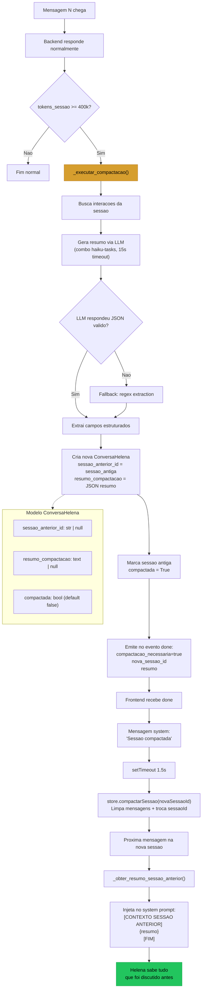

---

## 4. MAPA DE ARQUIVOS — BACKEND

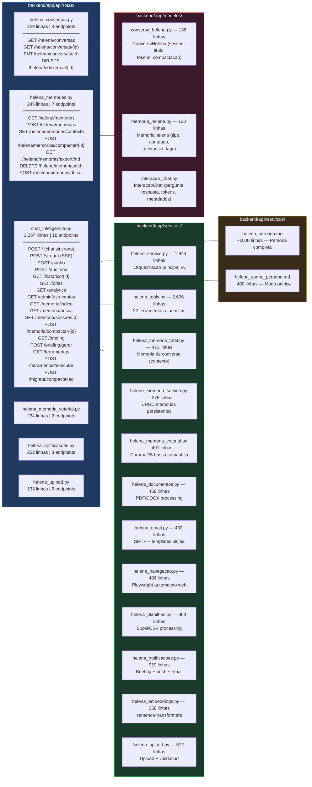

---

## 5. MAPA DE ARQUIVOS — FRONTEND

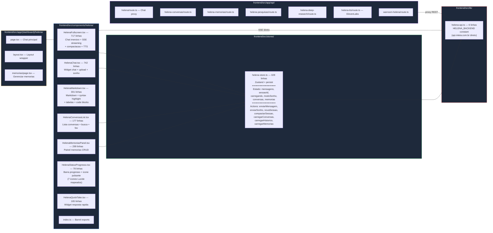

---

## 6. SISTEMA DE MEMORIAS

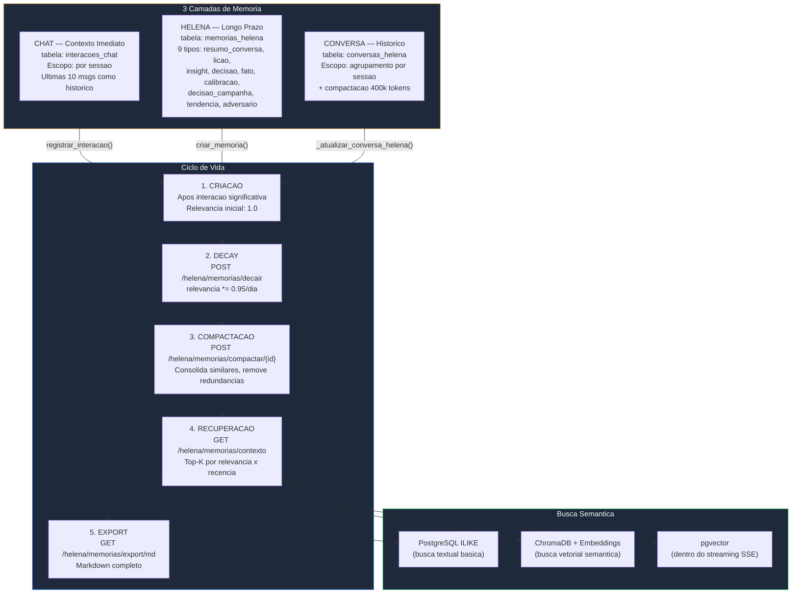

---

## 7. FERRAMENTAS HELENA (22 Tools)

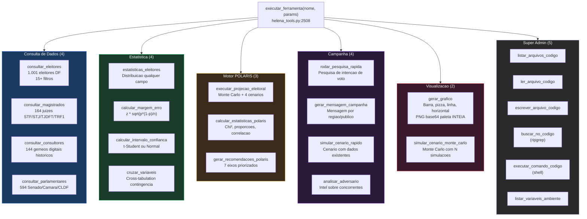

---

## 8. CADEIA DE PROVIDERS (OmniRoute)

```mermaid
flowchart LR
    subgraph HELENA["Helena pede resposta"]
        REQ["POST /stream<br/>ou POST /"]
    end

    subgraph OMNIROUTE["OmniRoute Gateway<br/>OMNIROUTE_URL"]
        COMBO["Combo: helena-premium<br/>(priority mode)"]
        P1["1. Claude Max<br/>(cc/claude-opus-4-6)"]
        P2["2. GPT-5<br/>(cx/gpt-5)"]
        P3["3. Gemini Pro<br/>(gc/gemini-3-pro)"]
        P4["4. Antigravity<br/>(ag/claude-opus-4-6-thinking)"]
        P5["5. GPT-4o<br/>(openai/gpt-4o)"]
    end

    subgraph FALLBACK["Fallbacks"]
        F1["Claude Code CLI<br/>(local, se disponivel)"]
        F2["API Anthropic<br/>(CLAUDE_API_KEY, pago)"]
    end

    REQ --> COMBO
    COMBO -->|"1o tentativa"| P1
    P1 -->|"falhou"| P2
    P2 -->|"falhou"| P3
    P3 -->|"falhou"| P4
    P4 -->|"falhou"| P5
    P5 -->|"todos falharam"| F1
    F1 -->|"falhou"| F2

    style HELENA fill:#1e293b,stroke:#d69e2e,color:#f8fafc
    style OMNIROUTE fill:#1e293b,stroke:#a855f7,color:#f8fafc
    style FALLBACK fill:#1e293b,stroke:#ef4444,color:#f8fafc
```

---

## 9. ENDPOINTS COMPLETOS — Referencia Rapida

```mermaid
graph TB
    subgraph CHAT["/api/v1/chat-inteligencia/ — 18 endpoints"]
        direction TB
        E1["POST / — Chat sincrono"]
        E2["POST /stream — SSE streaming 7 etapas"]
        E3["POST /sonho — Modo onirico"]
        E4["POST /auditoria — Auditar resposta"]
        E5["GET /historico/{id} — Historico sessao"]
        E6["GET /todas — Todas conversas"]
        E7["GET /analytics — Analytics uso"]
        E8["GET /admin/uso-contas — Auditoria admin"]
        E9["GET /memoria/indice — Indice memorias"]
        E10["GET /memoria/busca — Buscar memorias"]
        E11["GET /memoria/sessao/{id} — Memorias por sessao"]
        E12["POST /memoria/compactar/{id} — Compactar manual"]
        E13["GET /briefing — Obter briefing"]
        E14["POST /briefing/gerar — Gerar briefing"]
        E15["GET /ferramentas — Listar ferramentas"]
        E16["POST /ferramentas/executar — Executar ferramenta"]
        E17["POST /migrate/compactacao — Migrar DB"]
    end

    subgraph CONV["/api/v1/helena/ — Conversas (4)"]
        EC1["GET /conversas"]
        EC2["GET /conversas/{id}"]
        EC3["PUT /conversas/{id}"]
        EC4["DELETE /conversas/{id}"]
    end

    subgraph MEMO["/api/v1/helena/ — Memorias (7)"]
        EM1["GET /memorias"]
        EM2["POST /memorias"]
        EM3["GET /memorias/contexto"]
        EM4["POST /memorias/compactar/{id}"]
        EM5["GET /memorias/export/md"]
        EM6["DELETE /memorias/{id}"]
        EM7["POST /memorias/decair"]
    end

    subgraph VET["/api/v1/helena/ — Vetorial (2)"]
        EV1["POST /busca-semantica"]
        EV2["POST /sincronizar-chromadb"]
    end

    subgraph NOT["/api/v1/helena/ — Notificacoes (3)"]
        EN1["POST /briefing"]
        EN2["POST /relatorio-semanal"]
        EN3["POST /push-subscribe"]
    end

    subgraph UPL["/api/v1/helena/ — Upload (2)"]
        EU1["POST /upload-documentos"]
        EU2["POST /upload-planilhas"]
    end

    style CHAT fill:#1a3a5f,stroke:#3b82f6,color:#f8fafc
    style CONV fill:#1a3a2a,stroke:#22c55e,color:#f8fafc
    style MEMO fill:#3a2a1a,stroke:#d69e2e,color:#f8fafc
    style VET fill:#2a1a3a,stroke:#a855f7,color:#f8fafc
    style NOT fill:#3a1a1a,stroke:#ef4444,color:#f8fafc
    style UPL fill:#2a2a2a,stroke:#64748b,color:#f8fafc
```

---

## 10. FUNCOES-CHAVE DO BACKEND — Onde esta o que

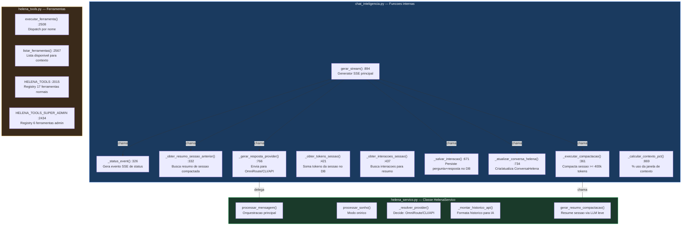

---

## 11. DADOS QUE HELENA ACESSA

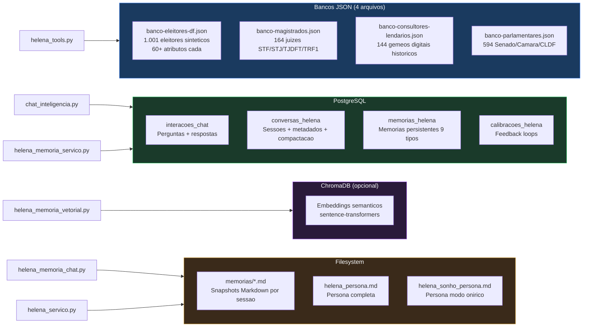

---

## 12. SKILLS — Indice para IAs

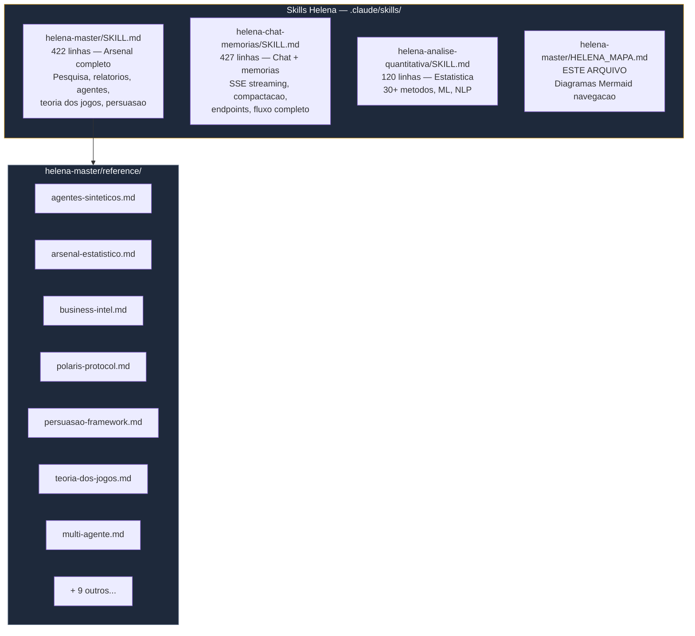

---

## GUIA RAPIDO — "Onde mexer para..."

| Tarefa | Arquivo Principal | Linha/Funcao |
|--------|-------------------|--------------|
| Mudar persona Helena | `backend/app/servicos/helena_persona.md` | Documento inteiro |
| Adicionar ferramenta | `backend/app/servicos/helena_tools.py` | `HELENA_TOOLS` dict :2015 |
| Novo endpoint chat | `backend/app/api/rotas/chat_inteligencia.py` | `router` :77 |
| Mudar status SSE | `backend/app/api/rotas/chat_inteligencia.py` | `_status_event()` :326 |
| Mudar compactacao | `backend/app/api/rotas/chat_inteligencia.py` | `_executar_compactacao()` :361 |
| Mudar threshold 400k | `backend/app/api/rotas/chat_inteligencia.py` | `GATILHO_COMPACTACAO_TOKENS` :157 |
| UI do chat | `frontend/src/components/helena/HelenaFullscreen.tsx` | Componente inteiro |
| Estado global | `frontend/src/stores/helena-store.ts` | Zustand store |
| Barra progresso | `frontend/src/components/helena/HelenaStatusProgresso.tsx` | 78 linhas |
| Markdown render | `frontend/src/components/helena/HelenaMarkdown.tsx` | 301 linhas |
| URL backend | `frontend/src/lib/helena-api.ts` | `HELENA_BACKEND` |
| Modelo DB conversa | `backend/app/modelos/conversa_helena.py` | `ConversaHelena` |
| Modelo DB memoria | `backend/app/modelos/memoria_helena.py` | `MemoriaHelena` |
| Provider IA | `backend/app/servicos/helena_servico.py` | `_resolver_provider()` |
| TTS (voz) | `frontend/src/app/api/helena-tts/route.ts` | ElevenLabs proxy |
| Notificacoes | `backend/app/servicos/helena_notificacoes.py` | 919 linhas |
| Upload docs | `backend/app/servicos/helena_upload.py` | 572 linhas |

---

*Mapa gerado em 2026-03-01 | ~20.000 linhas de codigo | 36 endpoints | 22 ferramentas | 12 servicos | 7 componentes*
